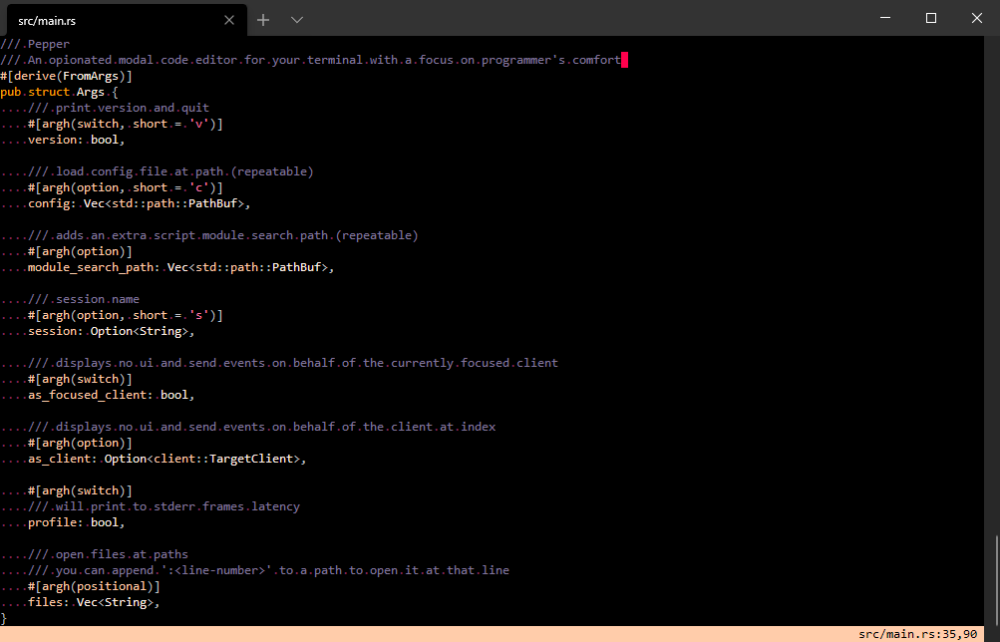

[](https://github.com/vamolessa/pepper)

(I'm currently refactoring the platform layer. So we have to first finish this cleanup before we're able to continue adding features)

### A simple and opinionated modal code editor for your terminal



[more screenshots](https://github.com/vamolessa/pepper/wiki/screenshots)

Pepper is an experiment of mine to simplify code editing from the terminal.
It's mission is to be a minimal and fast code editor with an orthogonal set of both editing and navigation features.

## [default keybindings](https://github.com/vamolessa/pepper/wiki/bindings)
## [scripting api](https://github.com/vamolessa/pepper/wiki/scripting-api-reference)
## [defining language syntaxes](https://github.com/vamolessa/pepper/wiki/language-syntax-definitions)
## [config recipes](https://github.com/vamolessa/pepper/wiki/config-recipes)

# installation

## binaries
Pepper is open-source, which means you're free to build it and access all of its features.
However, to support the development, prebuilt binaries are available for purchase at itch.

[vamolessa.itch.io/pepper](https://vamolessa.itch.io/pepper)

This will not only keep you updated with the latest features/fixes but also support further
pepper development!

## using [`cargo`](https://doc.rust-lang.org/cargo/)
Simply running `cargo install pepper` should get you up and running.

## from source
```
git clone git@github.com:vamolessa/pepper.git
cd pepper
cargo install --path .
```

**NOTE**: installing from source still requires `cargo` (at least it's easier this way).

## if you find a bug or need help
Please [open an issue](https://github.com/vamolessa/pepper/issues)

# goals

- small, but orthogonal, set of editing primitives
- mnemonic and easy to reach default keybindings (assuming a qwerty keyboard)
- cross-plaftorm (Linux, Windows, Mac)
- customizable through scripting
- extensible through external cli tools
- be as fast and reponsive as possible

# non goals

- support every possible workflow (it will never ever get close to feature parity with vim or emacs)
- complex ui (like breadcumbs, floating windows, extra status bars, etc)
- multiple viewports (leave that to your window manager/terminal multiplexer. instead clients can connect to each other and act together as if they're a single application)
- undo tree
- support for text encodings other than UTF-8
- fuzzy file picker (you can integrate with fzf, skim, etc)
- workspace wide search (you can integrate with grep, ripgrep, etc)
- having any other feature that could be implemented by integrating an external tool

# features

- everything is reachable through the keyboard
- modal editing (normal mode also selects text)
- multiple cursors
- caret style cursors (like most text editors, cursors can move past last line character and text is always inserted to its left)
- text-objects
- macros
- lua scripting
- client/server architecture
- simple syntax highlighting
- support for language server protocol

# philosophy

In the spirit of [Handmade](https://handmade.network/), almost all features are coded from scratch using simple stable Rust code.
These are the only external crates being used in the project:
- `fuzzy-matcher`: fuzzy matching for the picker ui. it could be replaced, however it's implementation does not get in the way and has minimal dependencies
- `winapi` (windows-only): needed to implement windows platform layer

# modal editing

Pepper is modal which means keypresses do different things depending on which mode you're in.
However, it's also designed to have few modes so the overhead is minimal. Most of the time, users will be in
either `normal` or `insert` mode.

# comparing to vim

Like Vim, you have to actively start text selection.
However, unlike it, you can also manipulate selections in normal mode.
Also, there's no 'action' then 'movement'. There's only selections and actions.
That is, `d` will always only delete selected text. If the selection was empty, it does nothing.

Pepper expands on Vim's editing capabilities by supporting multiple cursors.
This enables you to make several text transformations at once.
Also, cursors behave like carets instead of blocks and can always go one-past-last-character-in-line.

# comparing to kakoune

Like Kakoune, you can manipulate selections while in normal mode and actions always operate on selections.
However, unlike it, normal mode remembers if you're selecting text or nor (think a pseudo-mode).
This way, there's no need for extra `alt-` based keybindings.

Pepper is heavily inspired by Kakoune's selection based workflow and multiple cursors.
However its cursors behave like caret ranges instead of block selections.
That is, the cursor is not a one-char selection but only a visual cue to indicate the caret location.

# development thread
It's possible to kinda follow Pepper's development history in this [twitter thread](https://twitter.com/ahvamolessa/status/1276978064166182913)

# big features todo
- linux platform layer
- mac/bsd platform layer
- debug adapter protocol

# support pepper development
Pepper is open-source, which means you're free to build it and access all of its features.
However, to support the development, prebuilt binaries are available for purchase at itch.

Please consider purchasing in order to support both the development of new features and bug fixing.
I'll be forever grateful :)

<iframe src="https://itch.io/embed/810985?border_width=0" width="206" height="165" frameborder="0">
  <a href="https://vamolessa.itch.io/pepper">pepper by Matheus Lessa</a>
</iframe>